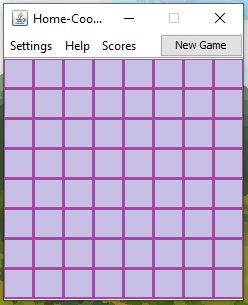
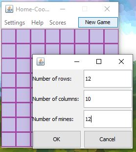
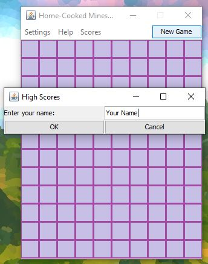
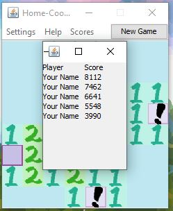

# 🚩💣 Minesweeper 💣 🚩

A simple Minesweeper written in Java, using an SQLite database to keep track of your high scores.

     

## Table of Contents

- [Description](#description)
- [Technologies](#technologies)
- [Installation](#installation)

## Description

The game features 3 different built-in board sizes and the option to create your very own board! Once you set up your
perfect board parameters, the game will remember your last choice, and you can play again and again by
clicking `New Game`!

> 

You may also save your name in the `Scores` menu:

> 

When a game is won, your score is calculated and saved to the database. The top 10 achievers can be checked at any time:

> 

You will also receive a unique message whenever you win a game by a score which is your new personal best, or if you
beat the previous high score!

## Technologies

- The application features a simplistic graphical user interface (GUI) written in Java using the evergreen Swing
  framework.
- Game score related information is stored in an SQLite database.
- Tests are conducted in JUnit 4 and Mockito.

## Installation

To compile and run the project you need Java 17 (or newer) installed on your computer.

1. Clone or download the project.
2. Navigate to the project's directory.
3. You can compile the project using Maven:
    - If you have Maven installed, you can execute `mvn clean install`.
    - Alternatively, you can use the provided Maven wrapper and execute `./mvnw clean install` instead.
4. After successful compilation, navigate to the `target` subdirectory, where you can find the executable JAR file.
5. While in the JAR's directory, launch the application by executing `java -jar Minesweeper.jar`!
6. Enjoy!

